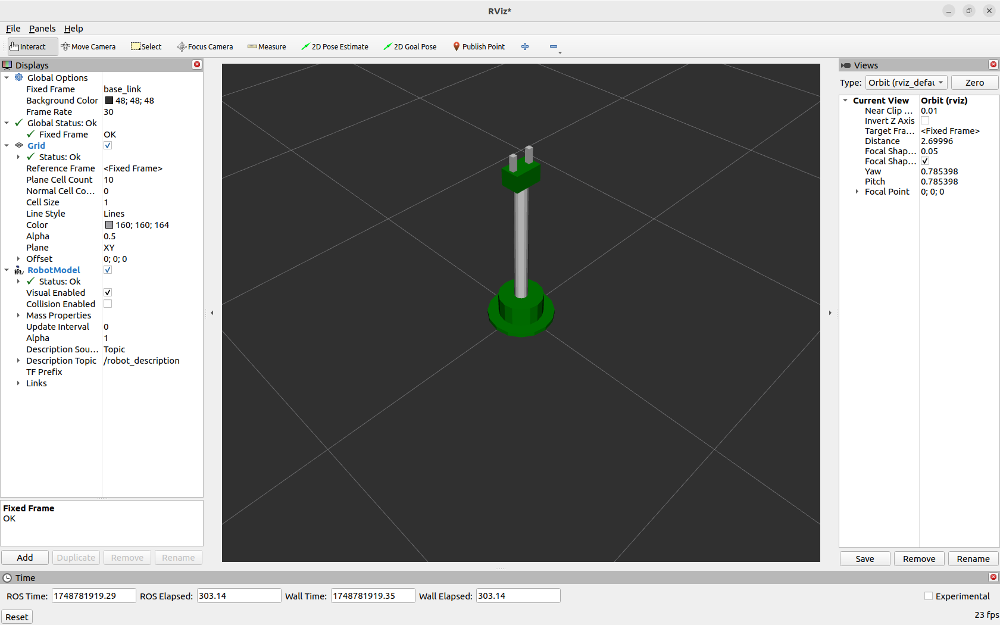
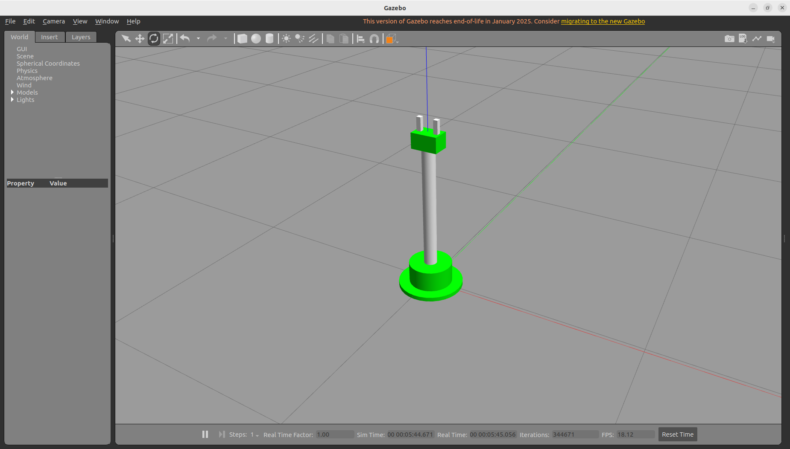

# 🤖 RR Robotic Arm (2-DOF + Gripper) Simulation in ROS 2 Humble

This repository contains a complete simulation of a 2-DOF robotic arm with a working gripper using ROS 2 Humble, Gazebo, RViz2, ros2_control, and Python control scripts.

---
## 📷 Demo View




---

## 📹 Demo Video

[▶️ Click here to watch the demo](https://drive.google.com/file/d/12DxS9SWpQTzVaXDzNe8zs0KWsjZMv5YL/view?usp=sharing)

---

## 📁 Folder Structure

```
rr_robotic_arm/
├── config/
│   └── ros2_controllers.yaml         # Controller configuration
├── launch/
│   ├── gazebo_launch.py              # Launch Gazebo
│   ├── spawn_robot_launch.py         # Spawn robot and start robot_state_publisher
│   └── launch_controllers_and_rviz.py # Load controllers and RViz
├── rviz/
│   └── rr_robotic_arm.rviz           # RViz config with RobotModel + TF
├── scripts/
│   ├── move_arm_to_target.py         # Python script to move joints
│   └── gripper_command.py            # Python script to open/close gripper
├── urdf/
│   ├── arm_with_gripper.xacro        # Main robot xacro with transmission
│   ├── gazebo_plugins.xacro          # Xacro plugin for gazebo_ros2_control
│   └── ros2_control_config.xacro     # Xacro containing <ros2_control> tag
├── setup.py                          # Python package setup with install details
└── package.xml                       # ROS 2 package dependencies
```

---

## 🚀 Features

- 2-DOF robotic arm with joints `joint1` and `joint3`
- Functional gripper with `finger_joint1` and `finger_joint2`
- Position control using `joint_trajectory_controller` and `forward_command_controller`
- Full integration with Gazebo simulation
- Live robot state visualization in RViz
- Custom Python scripts to control the arm and gripper
- Structured launch system for modularity

---

## 🧱 URDF/XACRO Breakdown

### ✅ `robot.urdf.xacro`

* Main file containing robot's links and joints
* Includes all visuals, collisions, inertials
* Adds necessary transmissions for each joint

### ✅ `robot.gazebo.xacro`

* Loads the `libgazebo_ros2_control.so` plugin
* Links `ros2_controllers.yaml` for controller parameters

```xml
<plugin filename="libgazebo_ros2_control.so" name="gazebo_ros2_control">
  <robot_sim_type>gazebo_ros2_control/GazeboSystem</robot_sim_type>
  <parameters>$(find rr_robotic_arm)/config/ros2_controllers.yaml</parameters>
</plugin>
```

### ✅ `robot.ros2_control.xacro`

* Declares the `<ros2_control>` interface
* Specifies hardware interface: `gazebo_ros2_control/GazeboSystem`

---

## ⚙️ Controller Configuration: `config/ros2_controllers.yaml`

### Arm Controller

```yaml
arm_controller:
  type: joint_trajectory_controller/JointTrajectoryController
  joints:
    - joint1
    - joint3
```

### Gripper Controller

```yaml
gripper_controller:
  type: forward_command_controller/ForwardCommandController
  joints:
    - finger_joint1
    - finger_joint2
  interface_name: position
```

---

## 🧠 RViz Configuration: `rviz/rr_robotic_arm.rviz`

* Preconfigured layout showing TF and robot model
* Robot Description: `/robot_description`
* Fixed Frame: `base_link`

---

## 🧪 Launch Files

| File                                    | Purpose                                         |
| --------------------------------------- | ----------------------------------------------- |
| `gazebo_launch.py`                      | Launches Gazebo with custom world               |
| `spawn_robot_launch.py`                 | Spawns robot and starts `robot_state_publisher` |
| `launch_controllers_and_rviz_launch.py` | Loads controllers and opens RViz2               |

Launch them in 3 terminals:

```bash
ros2 launch rr_robotic_arm gazebo_launch.py
ros2 launch rr_robotic_arm spawn_robot_launch.py
ros2 launch rr_robotic_arm launch_controllers_and_rviz_launch.py
```

---

## 🧾 Control Scripts

### 1. Move Arm to Target

```bash
ros2 run rr_robotic_arm move_arm_to_target 30 -45
```

* Moves `joint1` and `joint3` to specified angles in degrees
* Accepts joint angles as CLI args (degrees)
* Sends a JointTrajectory message

### 2. Gripper Control

```bash
ros2 run rr_robotic_arm gripper_command open
ros2 run rr_robotic_arm gripper_command close
```

* Opens or closes the gripper using preset joint values
* Accepts `open` or `close` as CLI arg
* Sends command to both gripper joints

---

## 📦 Package Creation & Dependencies

### ✅ How the Package Was Created

```bash
cd ~/gahan_ai_ws/src
ros2 pkg create rr_robotic_arm \
  --build-type ament_python \
  --dependencies rclpy std_msgs sensor_msgs geometry_msgs trajectory_msgs controller_manager xacro gazebo_ros2_control launch launch_ros
```

### 🧩 Dependency Purpose

| Dependency             | Purpose                                     |
| ---------------------- | ------------------------------------------- |
| `rclpy`                | ROS 2 Python client library                 |
| `std_msgs`             | Standard message types (e.g. Header)        |
| `sensor_msgs`          | For joint states, IMU, etc.                 |
| `geometry_msgs`        | For transforms (if needed)                  |
| `trajectory_msgs`      | JointTrajectory messages                    |
| `controller_manager`   | Manages robot controllers                   |
| `xacro`                | Macro-enabled URDF generation               |
| `gazebo_ros2_control`  | Plugin to connect ros2\_control with Gazebo |
| `launch`, `launch_ros` | Python-based ROS 2 launch system            |

### 📥 Install System Dependencies

```bash
sudo apt update && sudo apt install \
  ros-humble-xacro \
  ros-humble-joint-state-publisher \
  ros-humble-joint-state-publisher-gui \
  ros-humble-robot-state-publisher \
  ros-humble-rviz2 \
  ros-humble-gazebo-ros \
  ros-humble-ros2-control \
  ros-humble-ros2-controllers \
  ros-humble-forward-command-controller \
  ros-humble-position-controllers \
  ros-humble-joint-trajectory-controller \
  ros-humble-controller-manager 
```

### 🛠️ Build Instructions

```bash
cd ~/gahan_ai_ws
colcon build --packages-select rr_robotic_arm
source install/setup.bash
```

---

## 🧪 Run the Simulation

Open **3 terminals**:

**Terminal 1: Gazebo**

```bash
ros2 launch rr_robotic_arm gazebo_launch.py
```

**Terminal 2: Spawn Robot**

```bash
ros2 launch rr_robotic_arm spawn_robot_launch.py
```

**Terminal 3: Launch Controllers + RViz**

```bash
ros2 launch rr_robotic_arm launch_controllers_and_rviz.py
```

Then in any terminal:

**Move arm (degrees):**

```bash
ros2 run rr_robotic_arm move_arm_to_target 30 -45
```

**Open Gripper:**

```bash
ros2 run rr_robotic_arm gripper_command open
```

**Close Gripper:**

```bash
ros2 run rr_robotic_arm gripper_command close
```

---

## 🔗 Demo Video

Watch the simulation in action here: [📹 Google Drive Video Link](https://drive.google.com/file/d/12DxS9SWpQTzVaXDzNe8zs0KWsjZMv5YL/view?usp=sharing)

---

Happy Simulating! 🚀
